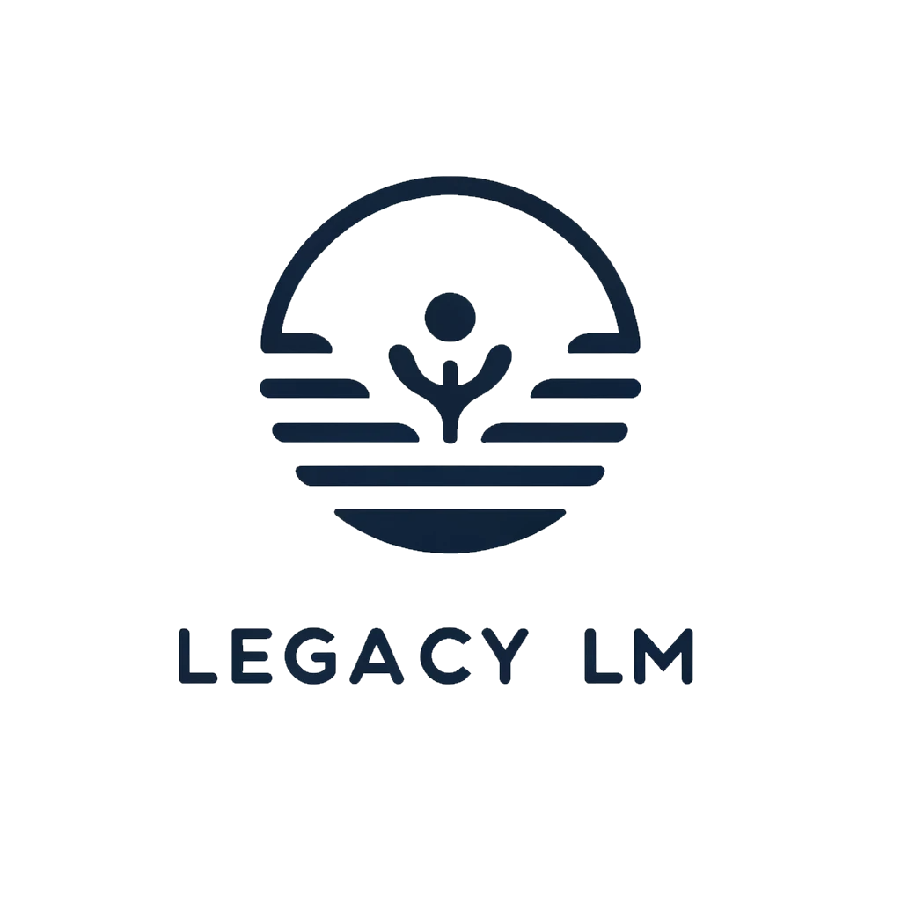

## Inspiration

Preserving personal legacies is an ongoing concern for many. As time passes, memories fade, voices are lost, and the essence of individuals can become distant.

## What it does

Our solution offers a unique way to overcome this by enabling individuals to create personalized conversational AI models, ensuring that your legacy—your voice, stories, and personality—endures beyond your lifetime, providing comfort and connection to your loved ones in the future.

## How we built it

The tool works in 2 stages:
1. Building a persona by having a conversation/answering questions (GPT to generate questions, text-to-speech to ask questions, speech-to-text to register responses). The audio + content is then used to personalise a GPT
2. Having a casual chat with the generated persona (speech-to-text to register the user’s conversation, GPT with persona to generate response, text-to-speech to give responses with the mimicked voice)

## Challenges we ran into

- Figuring out API calls
- Working out how to have a fluent conversation with the chatbot (e.g. how long to wait to respond etc.)
- Slow model generation since we need real-time conversations

## What we learned

- Require high-quality recordings to have good voice-mimicking
- Many models are inherently biased (e.g. text-to-speech models were quite good overall but added a slight American accent to most voices)

## Accomplishments that we're proud of

- Implementing a working end-to-end prototype that performs quite well considering the time we had
- Empowering users to leave behind a digital legacy, aiding in the bereavement process for their loved ones.

## What's next for Legacy LM

- Refining the voice mimicry and persona adoption
- Building it out into a user-friendly tool
- Improving conversation latency to sound more fluent
- Expand into other use cases of personalised GPTs (e.g. personal memoirs)

## Built With

Python, Hugging Face, OpenAI, ElevenLabs
